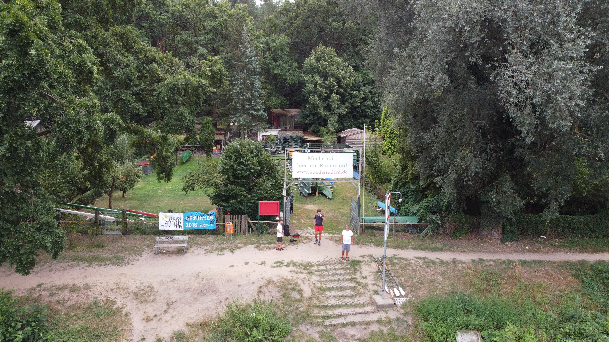
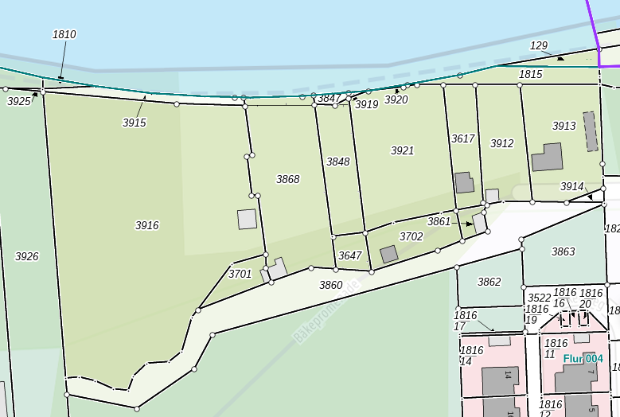

Der Ruderclub KST wurde im Dezember 2001 gegründet. Im April 2002 pachtete er sein erstes Grundstück von 650m². 

Im Jahr 2010 wurde ein [Nachbargrundstück zur Pacht](/berichte//2010/erweiterungsgelaende_2010) übernommen, womit sich die Fläche auf 1.295m² nahezu verdoppelte.

Im selben Jahr konnten wir beide Pachtgrundstücke kaufen. 

Bei der anschließenden Vermessung ergab sich, dass weitere 295m² des Grundstücks gar nicht uns gehörten, sondern einer Immobilienverwaltung des Bundes.
Die Korrektur dieses Fehlers kostete uns weitere Jahre, bis wir schließlich 2015 den oberen Teil des Grundstücks kaufen konnten. Übrigens für einen unverschämten Preis.

Damit befand sich endlich das gesamte vom Ruderclub genutzte Gelände im Eigentum des Ruderclubs. (Flurstück 3868)

Leider verlangte die Bauverwaltung des Landkreises PM eine Klärung des Zufahrtweges zum Ruderclub. 

Um hier eine rechtssichere Zufahrt sicher zu stellen, beschloß eine Hauptversammlung des Ruderclubs 2024 den Kauf des Waldweges zum Ruderclub.

Damit gehören jetzt weitere 1.948 m² dem Ruderclub. Vom Ende der Bäkepromenade (wo die letzten Häuser stehen) bis zum letzten Gartengrundstück. (Flurstück 3860 + 3914)
Ein Kauf, der uns auf Grund der Kosten nicht gerade glücklich machte, aber was tut man nicht alles in Deutschland, um rechtlich abgesichert zu sein.

Der gesamte Grundstückserwerb erfolgte aus Eigenmitteln, ohne Umlage und natürlich ohne Fördermittel. (Es gibt in Deutschland grundsätzlich keine Fördermittel für Geländekäufe)
