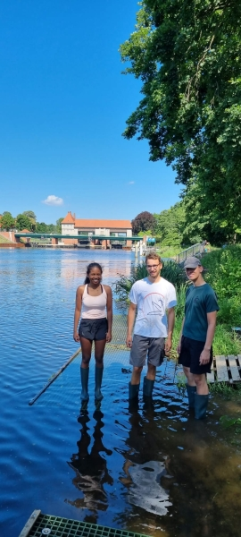
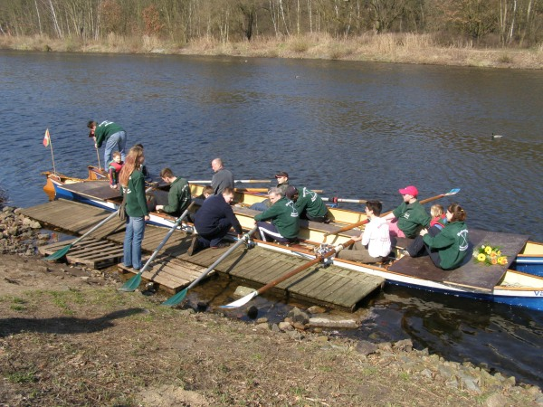
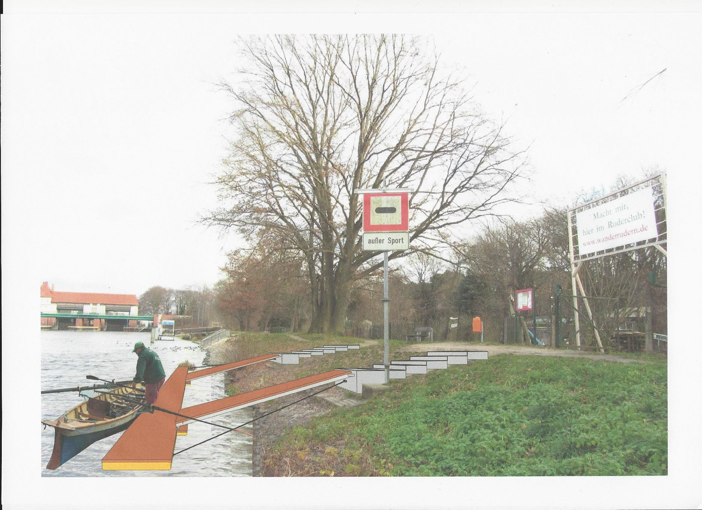

## Was braucht man, wenn man ein Grundstück am Wasser hat und einen Ruderclub starten möchte?

Richtig einen Steg. Das ist das erste Modell 2002 im April zu Wasser getragen.
Nach jedem Rudern haben wir den wieder aufs Gelände gebracht.

Gerne wurde er auch mal von ein paar Anglern ins Wasser geworfen, so dass er uns auf dem Rückweg auch schon mal entgegentrieb.

Anstelle der Euro-Palette wird mit zwei, später drei Schwerlastregalteilen als Unterbau ein neuer Steg konstruiert, den kein Angler mehr ins Wasser werfen kann.
Allerdings lässt er sich auch nur mit 3-4 kräftigen Ruderern an die wechselnden Wasserstände anpassen.

Ab 2008 versuchen wir die Genehmigung für einen üblichen Ruderbootsteg zu bekommen. 
Daraus ergibt sich eine unendliche Geschichte mit 13 Jahren Rechtsstreit.

Nachdem wir insgesamt vier Gerichte beschäfigt haben, gelingt es uns schließlich im April 2024 unseren neuen Steg einzuweihen.
Der Dank gilt unserem Rechtsanwalt Martin, der sich nie unterkriegen liess, den Gemeinden Kleinmachnow und Stahnsdorf, sowie den vielen Spendern aus der Mitgliederschaft.
Und natürlich allen Mitgliedern, die geholfen haben Genehmigung und Aufbau zu realisieren.

[Stegeinweihung April 2024](/berichte//2024/stegeinweihung_2024)
