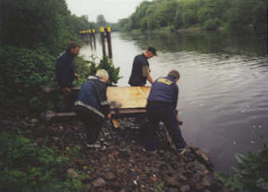
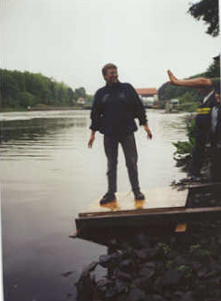
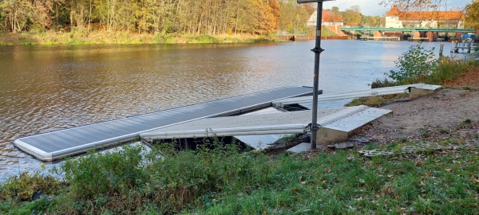

## Was braucht man, wenn man ein Grundstück am Wasser hat und einen Ruderclub starten möchte?

Richtig einen Steg. Das ist das erste Modell 2002 im April zu Wasser getragen.
Nach jedem Rudern haben wir den wieder aufs Gelände getragen. 
Gerne wurde er auch mal von ein paar Anglern ins Wasser geworfen, so dass er uns auf dem Rückweg auch schon mal entgegentrieb.

